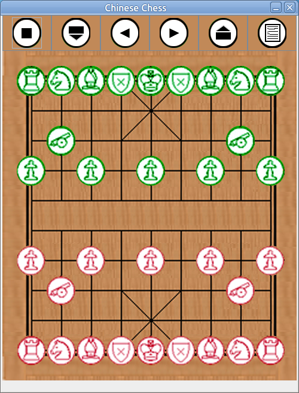

# Chinese Chess App

An implementation (from way back in the year 2006) of the Chinese Chess boardgame.



## Usage

### Download
```bash
git clone https://github.com/mm318/chinese-chess.git
```

There is a Makefile provided for your convenience to quickly build and run the app

### Build
```bash
# under the chinese-chess/ directory
make
```

### Run
Using the convenience Makefile to run the app will also implicitly rebuild
```bash
# under the chinese-chess/ directory
make run
```

(Tested on Ubuntu 20.04 with OpenJDK 17.)
